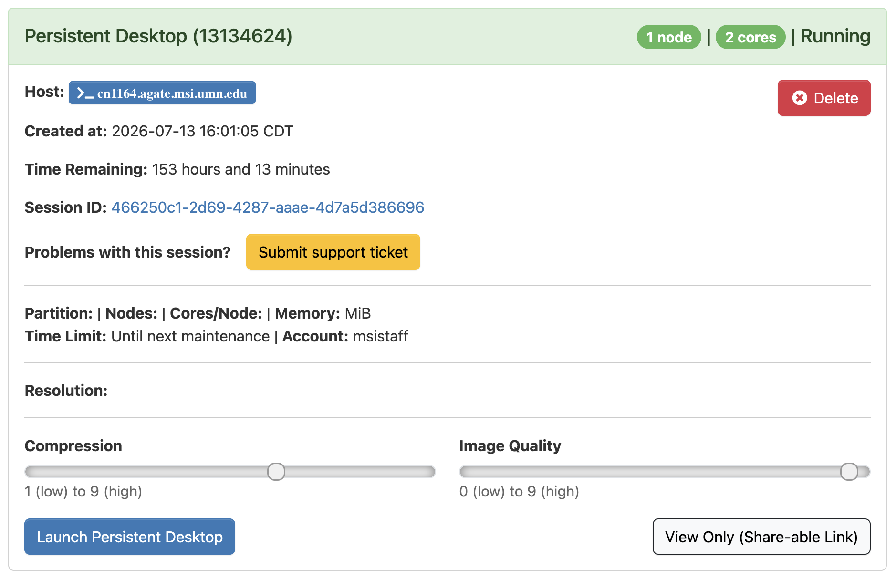

#+title: Cellpose-SAM Batch Workflow
#+author: Angel Mancebo and Myat Mo
#+options: ^:nil

#+begin_export html

#+end_export

* COMMENT Accessing MSI
Go to https://ondemand.msi.umn.edu . After logging in, click Interactive Apps and select Desktop. For the Account select ****. For the Resources select Interactive. Once the job starts, click Launch Persistent Desktop.

#+caption: This is a job card in Open OnDemand. For working with images, you will likely want to make sure the Image Quality is set to 9 (high). Compression is largely irrelevant but can affect latency at the extremes.

* COMMENT Getting the data
The following will involve working in a terminal within the OnDemand desktop environment. Should you like to, copying and pasting into and out of this desktop is handled by a clipboard, by default located within a blue tab on the right side of your browser window.

We will be using one of the datasets from the [[https://celltrackingchallenge.net][Cell Tracking Challenge]], /MDA231 human breast carcinoma cells infected with a pMSCV vector including the GFP sequence, embedded in a collagen matrix/.

Open a terminal and type

#+begin_src sh
wget https://data.celltrackingchallenge.net/training-datasets/Fluo-C3DL-MDA231.zip
#+end_src

to download the data. Type

#+begin_src 
unzip Fluo-C3DL-MDA231.zip
#+end_src

to extract the data. The images will be located under =Fluo-C3DL-MDA231/01=

* COMMENT Accessing Fiji
Once you are in the desktop session, open a terminal and type

#+begin_src bash
module load fiji/msi-x501
#+end_src

and press enter. Then type

#+begin_src bash
fiji
#+end_src

and press enter. The Fiji window should launch. You may get a harmless error in the terminal about X11 and XInitThreads.

* Running the segmentation
In Fiji, open one of the images by either dragging and dropping it from the file browser into Fiji or by clicking

/File/ → /Open.../

in Fiji and navigating to the directory the file is located in. Once an image is opened, click

/Plugins/ → /Segmentation/ → /Cellpose-SAM/

to launch Cellpose-SAM segmentation. If you can't see the /Segmentation/ section under the /Plugins/ menu, you may need to increase the height of your browser window.

Before you proceed to segmenting any images, open the macro recorder

/Plugins/ → /Macros/ → /Record.../

Since segmenting on CPU will take quite a long time for all 3D images (or even one image, for that matter), we will need to record the execution of Cellpose-SAM so that we can later automate it for running on a GPU. To save time, we will duplicate a small region of the first slice of the image and run Cellpose-SAM on only that. Find a slice with visible objects and crop out a small region containing an object.

For our 2D run, in the Cellpose-SAM options select

#+begin_quote
Cellpose model = cpsam

Mode 3D = None

Torch version = cpu

Use GPU = ✓
#+end_quote

When you run Cellpose-SAM for the first time, Appose will auto-install the Cellpose-SAM environment to your home directory and an installation popup will appear. This will take a few moments. Once the installation is finished, the segmentation process will start and you will see =Starting process...= appear in the terminal that Fiji was launched from.

After Cellpose-SAM is finished running, copy the output of the macro recorder, specifically the line beginning with =run("Cellpose-SAM..."=. Don't worry about the quality of the segmentation at this stage; we are only interested in the command that we'll need to run the segmentation as a batch job and we'll make the necessary changes to it to get a higher quality segmentation while benefiting from the acceleration of a GPU.

The original output will look something like this (*but don't use this as is!*):

#+begin_src java
run("Cellpose-SAM...", "cp_model=cpsam custom_model= cell_diameter=30 chan0=1 chan1=None chan2=None min_size=15 normalize=true resample=true return_rois=false cellprob_threshold=0.0 flow_threshold=0.4 tile_overlap=0.1 niter=0 compute_flows=false mode_3d=None stitch_threshold=0.0 flow3d_smooth=0 torchversion=cpu usegpu=true");
#+end_src

We will edit the command to have the following relevant parameters:

#+begin_quote
Cellpose model (=cp_model=) = cpsam_v2

Mode 3D (=mode_3d=) = 3D

Torch version (=torchversion=) = cu130

Use GPU (=usegpu=) = ✓
#+end_quote

First, we'll use the improved Cellpose-SAM version 2 (cpsam_v2) model instead of the older cpsam model. We'll also change the Mode 3D from None (purely 2D) to 3D to process an entire z-stack. The last thing we'll change is the Torch version, from =cpu= (running on CPU, slow) to =cu130= (running on a GPU with CUDA ≥13.0, fast). The option Use GPU should be =true= in the command or the GPU will not be used, even if it is available. The final command should look like this:

#+begin_src java
run("Cellpose-SAM...", "cp_model=cpsam_v2 custom_model= cell_diameter=30 chan0=1 chan1=None chan2=None min_size=15 normalize=true resample=true return_rois=false cellprob_threshold=0.0 flow_threshold=0.4 tile_overlap=0.1 niter=0 compute_flows=false mode_3d=3D stitch_threshold=0.0 flow3d_smooth=0 torchversion=cu130 usegpu=true");
#+end_src

* Automating the segmentation
Copy and paste the following script into the macro editor (/Plugins/ → /New/ → /Macro/). Edit the input and output paths (look for the lines below the =FIXME= comments). Modify the macro as needed to open the image you previously saved. Save the macro to some path within your home directory under the name =cellpose_sam.ijm=.

#+name: cellpose_sam.ijm
#+begin_src java
// FIXME: Set the path where the images are located.
dir = "/absolute/path/to/data/Fluo-C3DL-MDA231/01";
// Get a list of all the files in the directory.
files = getFileList(dir);

// FIXME: Iterate over the files list.
for (i = 0; i < files.length; i++) {
    // The files list contains all files in the directory, including other directories, so check if the file name ends in ".tif" or ".tiff" and starts with "t". This pattern is highly specific to the dataset we are using.
    if ((endsWith(files[i], ".tif") || endsWith(files[i], ".tiff")) && startsWith(files[i], "t")) {
	// Open the file using the absolute path.
	open(dir + "/" + files[i]);
    }
}

// Concatenate all open files. This will create a new time axis, resulting in a 4-dimensional image.
run("Concatenate...", "all_open title=all_times.tif open");

// Run Cellpose-SAM using the parameters for GPU segmentation.
run("Cellpose-SAM...", "cp_model=cpsam_v2 custom_model= cell_diameter=30 chan0=1 chan1=None chan2=None min_size=15 normalize=true resample=true return_rois=false cellprob_threshold=0.0 flow_threshold=0.4 tile_overlap=0.1 niter=0 compute_flows=false mode_3d=3D stitch_threshold=0.0 flow3d_smooth=0 torchversion=cu130 usegpu=true");

// Search for the newly created segmentation image and save it.
titles = getList("image.titles");
for (i = 0; i < titles.length; i++) {
    if (titles[i].contains("Cellpose-SAM")) {
        selectImage(titles[i]);
        // FIXME: Set the path to save the final image to.
        saveAs("Tiff", "/absolute/output/path/Fluo-C3DL-MDA231_Cellpose-SAM_segments.tif");
        break;
    }
}
#+end_src

* Submitting jobs
At MSI we use the SLURM scheduler. A scheduler considers what resources are requested and what resources are available, and determines when resources can be allocated to a request (called a /job/). The more resources you ask for (e.g. memory, cores, time), the more time your job is likely to spend on the /queue/ as it awaits allocation. We will request a modest (by high-performance computing standards) amount of resources and most importantly we will request an NVIDIA A100 GPU.

In Open OnDemand, select /Jobs/ → /Job Composer/. Create a /New Job/ and select /From Default Template/. Scroll down to where it says /Submit Script/ and click /Open Editor/. Delete the default contents of the file and paste in the following snippet, replacing the asterisks next to account and partition with what the instructors provide, and replacing =YOUR.EMAIL.HERE@umn.edu= with your UMN email address:

#+begin_src bash
#!/bin/bash -l
#SBATCH --time=1:00:00
#SBATCH --ntasks=16
#SBATCH --mem=60g
#SBATCH --tmp=10g
#SBATCH --mail-type=ALL
#SBATCH --mail-user=YOUR.EMAIL.HERE@umn.edu
#SBATCH --partition=gpu-tutorial
#SBATCH --gres=gpu:a100:1
#SBATCH --output=slurm_job_logs/job_%j.txt

# Change directory to the where the script was submitted from.
cd "$SLURM_SUBMIT_DIR"

# Run the NVIDIA System Management Interface to see the status of the GPU.
nvidia-smi

# Load the fiji module to get access to fiji.
module load fiji/msi-x501

# FIXME: Run the Fiji macro in headless mode since it will need to run without a graphical session.
fiji --headless -macro /absolute/path/to/cellpose_sam.ijm
#+end_src

Once you are done editing your job, ask your instructor to look it over and click /Submit/ on the Jobs page to submit the job to the queue.

You can view the status of your job(s) in a terminal with
#+begin_src sh
squeue --me
#+end_src

* COMMENT Running the tracking
In Fiji, open the segmented image. Go to 
